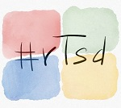

# Road to Surface Duo Xamarin App (#rTsd)
> This ia a work in progress [Xamarin.Forms](https://dotnet.microsoft.com/apps/xamarin) Android project which is intended to feature most of the new features that makes the upcoming [Microsoft Surface Duo](https://www.microsoft.com/en-us/surface/devices/surface-duo) phone unique.

## Build status

|Service|Status|
|-------|------|
|AppCenter|

## Prerequirements
- Windows 10 / macOS 
- [Visual Studio 2019](https://visualstudio.microsoft.com/) (for Mac)
- Installed Xamarin Visual Studio plugins

## Other programms I used
- Microsoft [OneNote](https://www.onenote.com/) as information storage around the idea of the app
- Microsoft [Teams](https://products.office.com/en-US/microsoft-teams/group-chat-software) to clarify open question with the Dr. Windows team
- [Visual Studio Code](https://code.visualstudio.com/) for all, except source code editing, writings like mark down files
- [Git Bash](https://git-scm.com/downloads) for Git operations outside of Visual Studio
- [Adobe XD](https://www.adobe.com/de/products/xd.html) to protoyp the UI

## Features
- Lists articles of [Dr. Windows](https://www.drwindows.de) 
- Good looking, hopefully (in my opinion)
- Utilizes Surface Duo features
- Utilizes App Center features

## UI concepts
I'm not a skilled user interface designer nor I have an eye for beauty, but the app should look mostly like the following concepts.

I used the free, but required an Adobe ID, application [Adobe XD](https://www.adobe.com/de/products/xd.html) to create the protoyp views.

## Keep in mind
This app is purely build for having fun! All features have room for improvements or could be done more elegant.

## Contributing
Feel free to improve the quality of the code. It would be great to learn more from experienced C#, Xamarin and Azure developers.

## Authors
Just me, [Tobi]([https://tscholze.github.io).

## Links
- [Dr. Windows](https://www.drwindows.de) German Microsoft blog
- [Xamarin](https://dotnet.microsoft.com/apps/xamarin) Homepage

## License
This project is licensed under the MIT License - see the [LICENSE](LICENSE) file for details.
Dependencies or assets maybe licensed differently.
