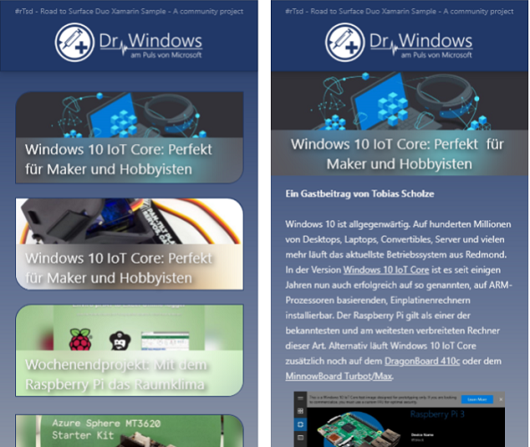
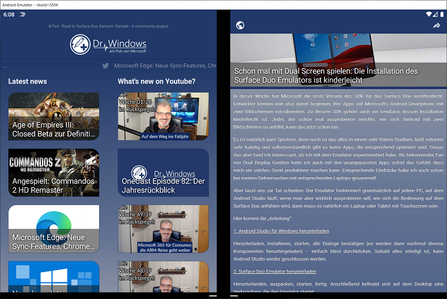

# Road to Surface Duo Xamarin App (#rTsd)
> This is a work in progress [Xamarin.Forms](https://dotnet.microsoft.com/apps/xamarin) Android project which is intended to feature most of the new features that makes the upcoming [Microsoft Surface Duo](https://www.microsoft.com/en-us/surface/devices/surface-duo) phone unique. It will use the awesome German [Dr. Windows](https://www.drwindows.de)  as data source for its articles.

## tl;dr
This is neither an offical [Dr. Windows](https://www.drwindows.de) app nor anything other than a highly motivated playground to dive deep into the Xamarin.Forms ecosystem with a dedicated usecase in mind.

It will target only Android devices and it's meant to include all other aspecs of Xamarin development such as a configurared continuous integration and analytics powerd by the [Azure App Center](https://azure.microsoft.com/en-us/services/app-center/).

This project is written and owned by a beginner and meant for beginners. It would be perfect if experts could mentor the project - but this is just a mind in the clouds.

If you are looking for the siblings app that's based on the UWP ecosystem to work with the Surface Neo, please see the GitHub repository [tscholze/uwp-road-to-surface-neo](https://github.com/tscholze/uwp-road-to-surface-neo). This project is currently on hold due to some emulator requirements that I cannot fulfill at the ment.

## Build status

|Service|Status|
|-------|------|
|AppCenter|
|Azure DevOps|
|Sonar Cloud||

## Releases

|Channel|Store|
|-------|-----|
|Beta | 

## Structure

**rTsd**

Xamarin.Forms container that includes all shared functionality and features.

**rTsd.Android**

Android wrapper and platform-specifc implementations like custom rendereres, effects or assets.

## Phases

- [x] Finding a usecase
- [x] Write down a motivation (e.g. Readme)
- [x] Write an email to `dualscreendev@microsoft.com` to get soon(tm) more information
- [x] Concept roughly an user interface
- [x] Get the project (template) up and running
- [x] Getting into important Xamarin / C# pattern
- [x] Write first MVP code
- [x] Implement first Surface Duo related features or layouts
- [x] Improve feature and code quality
- [x] Run it on a Surface Duo emulator
- [x] Add user opt-in for non Dr. Windows server requests
- [x] Add localization (resx)
- [ ] Write tests
- [ ] Leverage CI with tests and deployments
- [x] Run it on an actual Surface Duo device
- [ ] Add analytics

## Publications

- Microsoft: [The Dual-Screen Developer Experience: Interview with Tobias Scholze](https://devblogs.microsoft.com/surface-duo/the-dual-screen-developer-experience-interview-with-tobias-scholze/)
- Personal Blog: [[Projekt] #rTsd – Road to Surface Duo](https://tscholze.uber.space/2019/11/30/projekt-rtsd-road-to-surface-duo/)
- Personal Podcast: [LLD5 - Road To Surface Duo](https://soundcloud.com/user-886564691/lld5-road-to-surface-duo)
- Personal Podcast: [LLD8 - Ganz allein im Surface Duo Forum](https://soundcloud.com/user-886564691/lld8-ganz-allein-im-surface)
- Dr. Windows: [Surface Duo: Unser Tobias im Interview auf dem Microsoft-Blog](https://www.drwindows.de/news/surface-duo-unser-tobias-im-interview-auf-dem-microsoft-blog)
- Dr. Windows: [#rTsd – Road to Surface Duo, das Entwicklertagebuch: Teil 01](https://www.drwindows.de/news/rtsd-road-to-surface-duo-das-entwicklertagebuch-teil-1)
- Dr. Windows: [#rTsd – Road to Surface Duo, das Entwicklertagebuch: Teil 02](https://www.drwindows.de/news/road-to-surface-duo-das-entwicklertagebuch-teil-2)
- Dr. Windows: [#rTsd – Road to Surface Duo, das Entwicklertagebuch: Teil 03](https://www.drwindows.de/news/rtsd-road-to-surface-duo-das-entwicklertagebuch-teil-3)
- Dr. Windows: [#rTsd – Road to Surface Duo, das Entwicklertagebuch: Teil 04](https://www.drwindows.de/news/rtsd-road-to-surface-duo-das-entwicklertagebuch-teil-4)
- Dr. Windows: [#rTsd – Road to Surface Duo, das Entwicklertagebuch: Teil 05](https://www.drwindows.de/news/rtsd-road-to-surface-duo-das-entwicklertagebuch-teil-5)
- Dr. Windows: [#rTsd – Road to Surface Duo, das Entwicklertagebuch: Teil 06](https://www.drwindows.de/news/rtsd-road-to-surface-duo-das-entwicklertagebuch-teil-6-sdk-und-emulator)
- Dr. Windows: [#rTsd – Road to Surface Duo, das Entwicklertagebuch: Teil 07](https://www.drwindows.de/news/rtsd-road-to-surface-duo-das-entwicklertagebuch-teil-7-auf-dem-weg-zum-play-store)
- Dr. Windows: [#rTsd – Road to Surface Duo, das Entwicklertagebuch: Teil 08](https://www.drwindows.de/news/erste-beta-version-unserer-rtsd-app-ist-nun-zum-testen-bereit-entwicklertagebuch-teil-8)
- Dr. Windows: [#rTsd – Road to Surface Duo, das Entwicklertagebuch: Teil 09](https://www.drwindows.de/news/rtsd-road-to-surface-duo-das-entwicklertagebuch-teil-9-abwarten)
- Dr. Windows: [#rTsd – Road to Surface Duo, das Entwicklertagebuch: Teil 10](https://www.drwindows.de/news/rtsd-road-to-surface-duo-das-entwicklertagebuch-teil-10-die-krux-kein-testgeraet-zu-haben)

## Prerequirements
- Windows 10 / macOS 
- [Visual Studio 2019](https://visualstudio.microsoft.com/) (for Mac)
- Installed Xamarin Visual Studio plugins

## Assumption
- The Surface Duo will usw two navigation pages, master on the left screen and detail on the right, as the main indicator how to display an app on two screens -> Nope it works a little bit diffrent

## Other programms I used
- Microsoft [OneNote](https://www.onenote.com/) as information storage around the idea of the app
- Microsoft [Teams](https://products.office.com/en-US/microsoft-teams/group-chat-software) to clarify open question with the Dr. Windows team
- [Visual Studio Code](https://code.visualstudio.com/) for all, except source code editing, writings like mark down files
- [Git Bash](https://git-scm.com/downloads) for Git operations outside of Visual Studio
- [Adobe XD](https://www.adobe.com/de/products/xd.html) to protoyp the UI

## Features
- Good looking, hopefully (in my opinion)
- Utilizes Surface Duo features
- Utilizes App Center features
- Ticker with latest tweets of [@drwindows_de](https://twitter.com/drwindows_de)
- Lists articles of [Dr. Windows](https://www.drwindows.de) 
- Lists videos of [Dr. Windows Youtube Channel](https://www.youtube.com/user/DrWindowsTV)
- Detail article view
- Share functionality

## UI concepts
I'm not a skilled user interface designer nor I have an eye for beauty, but the app should look mostly like the following concepts.

## App screenshots

**Running on a Microsoft Surface Duo**

**Running on a standard Android phone**

I used the free, but required an Adobe ID, application [Adobe XD](https://www.adobe.com/de/products/xd.html) to create the protoyp views.

## Decisions made 
- Using the `Page.Navigation(...)` feature instead of the new url-based `Shell.GoToAsync(...)`
- Using the native asset management instead of the embedded images one. The not successful feature implementation can be found via: `deadend/embedded-images`

## Keep in mind
This app is purely build for having fun! All features have room for improvements or could be done more elegant.

## Contributing
Feel free to improve the quality of the code. It would be great to learn more from experienced C#, Xamarin and Azure developers.
Please use the "default" workflow of contributing to this project.
1. Open an issue and describing your idea or bug finding
1. Fork repository
1. Fix bug / add enhancement in well named feature branch with issue number (e.g. `user.name/2-added-app-icon`)
1. Add the issue number to your commit message (e.g. `#2 Added new app icon`)
1. Create pull request (PR) from your feature branch to this `master` branch 
1. Please keep in touch with your PR to answer upcoming questions
1. If your PR got merged, check if you are listed in the "Authors" section of the readme

## Special thanks to
- [Martin Geuss](https://twitter.com/martingeuss) (Dr. Windows) for letting me publish an article series on one of the largest German speaking Microsoft communities and portals [Dr. Windows](https://drwindows.de)
- [Sven-Michael Stübe](https://twitter.com/stuebe2k14) (Zuehlke) for helping me with is awesome knowledge of Xamarin
- [Tim Messerschmidt](https://twitter.com/seraandroid) (Google), for motivating me to give Android and the Google ecosystem another chance

## Authors
Just me, [Tobi]([https://tscholze.github.io).

## Links
- [Dr. Windows](https://www.drwindows.de) German Microsoft blog
- [Microsoft Docs](https://docs.microsoft.com/en-us/dual-screen/android/get-duo-sdk?tabs=java) for dual screen devices
- [Xamarin](https://dotnet.microsoft.com/apps/xamarin) Homepage

## License
This project is licensed under the MIT License - see the [LICENSE](LICENSE) file for details.
Dependencies or assets maybe licensed differently.
